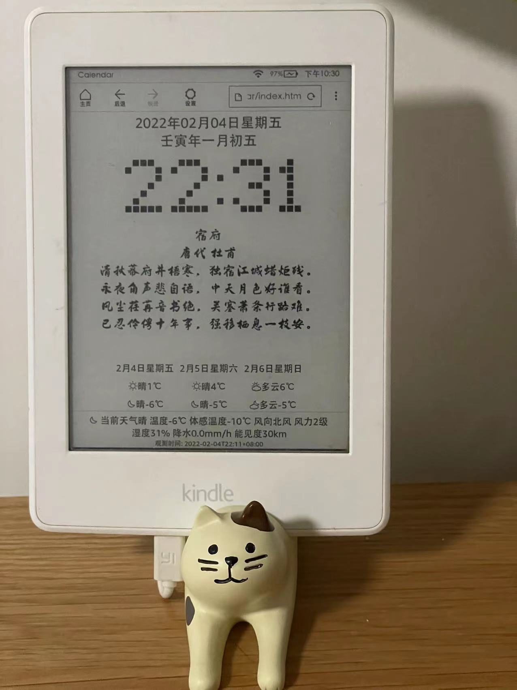

# Battery Saving Calendar for Kindle

## Features
* Weather forecasting
* Chinese lunar calendar
* Random Chinese Poetry
* Pure HTML5 technologies
* Only load data when necessary
* Avoid network traffic - may work offline if weather is not required.

## Usage
1. Register an account on https://dev.qweather.com/ and create a key.Application name can be any name. The key format should be like 	
**44de7becc22b4e8ca4971595fbab4c7f**.
1. Edit **accounts.js** and replace the **weather_key** to the key in the previous step
1. Set **weather_location** to a qweather location code (may find it from qweather document) or a coordinate of the location for weather.
1. Connect Kindle to PC USB port.
1. Copy all files under **\calendar** into **\Calendar** folder.
1. Disconnect the Kindle.
1. Open the Kindle web browser and enter the following URL:  
``
file:///mnt/us/calendar/index.htm
``

* Alternatively, you may also upload files on a web server and open the address to the web server from your Kindle.
* Offline Mode by Disable weather forecasting:
Edit index.htm and change
``
var Disable_Weather = false;
``
to
``
var Disable_Weather = true;
``

## Licenses
* The MIT License (MIT)
* Copyright (C) 2022 Jason Wang
* The services and data used by this software may be only free for non-commercial usage.

## References and Thanks:
#### Weather Service
https://dev.qweather.com/

#### Chinese Poetry:  
https://github.com/chinese-poetry/huajianji/tree/master/data

#### Chinese Lunar Calendar 万年历:  
http://www.forasp.cn/html/593.html

#### Free Fonts:
chesstype.chesstype.ttf:  
https://www.1001fonts.com/led-fonts.html

FZXiaKTJF.ttf:
https://www.foundertype.com/index.php/FindFont/index.html?hot=118

#### Kindle JavaScript and JQuery supports
https://decadecity.net/blog/2015/04/17/e-ink-kindle-web-browsers
